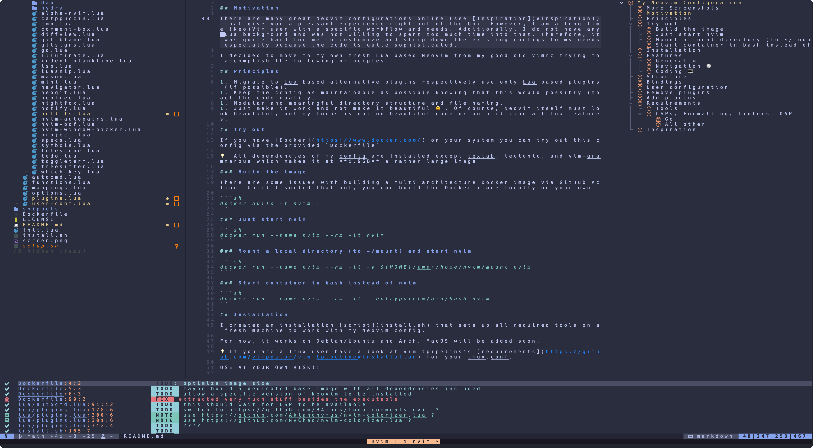
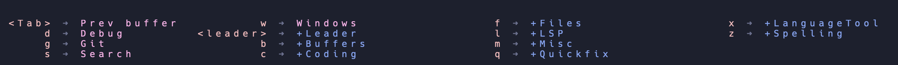
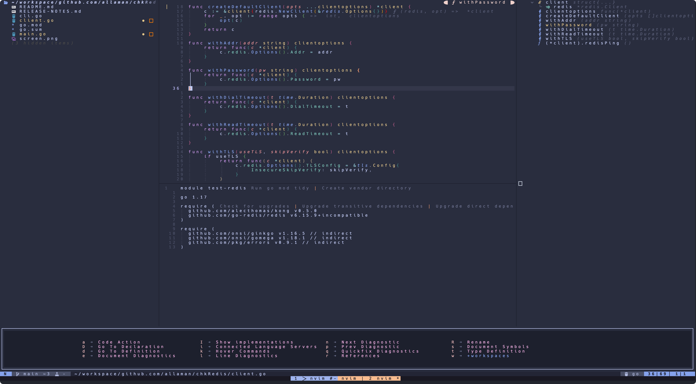
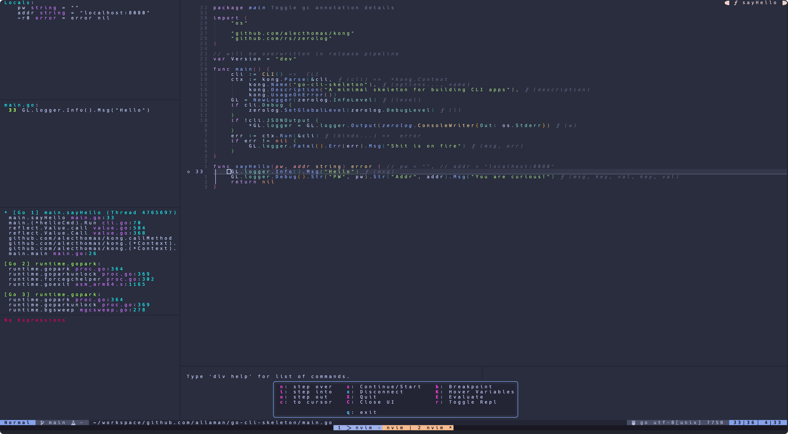

<h1 align="center">My Nvim Configuration</h1>

<div align="center"><p>
    <a href="https://github.com/neovim/neovim">
      
    </a>
    <a href="https://github.com/Allaman/nvim/pulse">
      
    </a>
    <a href="https://github.com/Allaman/nvim/issues">
      
    </a>
    <a href="https://github.com/Allaman/nvim/actions/workflows/ci.yml">
      
    </a>
    <a href="https://github.com/Allaman/nvim/blob/main/LICENSE">
      
    </a>
</p>

</div>



💻 This configuration works on my [NixOS](https://nixos.org/) Linux as well as on my macOS. It requires and is tested with Neovim >= 0.10. It should run with Neovim 0.9.5 but I can't recommend it.

Have a look at my [rice](https://github.com/Allaman/rice) how my Linux machine is configured and at my [mac-setup](https://github.com/Allaman/mac-setup) how my MBP is configured. My [dotfiles](https://github.com/Allaman/dots) are also on GitHub.

## More Screenshots

_Terminal_: alacritty

_Font_: Jetbrains Mono

<details>
<summary>Leader Key Clusters via which-key</summary>



See `./lua/core/config/ui/which-key.lua` for details.

</details>

<details>
<summary>Go development</summary>



</details>

<details>
<summary>Debugging via DAP</summary>



</details>

## Motivation

There are many great Neovim configurations (see [Inspiration](#inspiration)), that give you a pleasant experience right out of the box, available. However, I am a long time (Neo)Vim user with a specific workflow and needs. Additionally, I do not have any Lua background and was not willing to spent too much time into that. Therefore, it was quite hard for me to customize and strip down the existing configs to my needs especially because the code is quite sophisticated.

I decided to move to my own fresh Lua based Neovim from my good old vimrc trying to accomplish the following principles.

## Principles

1. Migrate to Lua based alternative plugins respectively use only Lua based plugins (if possible).
1. Keep the config as maintainable as possible knowing that this would possibly impact the code quality.
1. Modular and meaningful directory structure and file naming.
1. Just make it work and not make it beautiful 😃. Of course, Neovim itself must look beautiful, but my focus is not on beautiful code or on utilizing all Lua features.

## Features

### General ⚙️

- Package management and plugin configuration via [lazy.nvim](https://github.com/folke/lazy.nvim)
- Mnemonic keyboard mappings inspired by [Spacemacs](https://www.spacemacs.org/) via [which-key.nvim](https://github.com/folke/which-key.nvim); no more than three keystrokes for each keybinding
- Complete transformation via [noice.nvim](https://github.com/folke/noice.nvim)
- Fully featured status line via [lualine.nvim](https://github.com/nvim-lualine/lualine.nvim)
- Terminal integration via [nvim-toggleterm.lua](https://github.com/akinsho/nvim-toggleterm.lua)
- Fancy notifications via [nvim-notify](https://github.com/rcarriga/nvim-notify)
- Search and replace frontend via [nvim-spectre](https://github.com/nvim-pack/nvim-spectre) (optional)
- Better writing with [ltex-ls](https://valentjn.github.io/ltex/index.html)
- Multiple preconfigured themes like [catppuccin](https://github.com/catppuccin/nvim), [tokyonight](https://github.com/folke/tokyonight.nvim), [nightfox](https://github.com/EdenEast/nightfox.nvim), and more
- AI assistance with [ChatGPT.nvim](https://github.com/jackMort/ChatGPT.nvim), [gp.nvim](https://github.com/Robitx/gp.nvim), [copilot.lua](https://github.com/zbirenbaum/copilot.lua) (optionally), and [supermave-nvim](https://github.com/supermaven-inc/supermaven-nvim) (optionally)
- Health check via `checkhealth core`
- Lazy loading plugins (6 of 87 in my case)
- Startup <= 40 ms 🚀

### Navigation 🧭

- [fzf-lua.nvim](https://github.com/ibhagwan/fzf-lua) for all your search needs
- File tree navigation/manipulation via [neo-tree](https://github.com/nvim-neo-tree/neo-tree.nvim)
- Alternative file handling via [oil.nvim](https://github.com/stevearc/oil.nvim) (optional)
- [LF](https://github.com/gokcehan/lf) integration via [lf.nvim](https://github.com/lmburns/lf.nvim) (optional)
- [yazi](https://github.com/sxyazi/yazi) integration with [yazi.nvim](https://github.com/mikavilpas/yazi.nvim) (optional)
- Better Tmux navigation with your home row via [Navigator.nvim](https://github.com/numToStr/Navigator.nvim)

### Coding 🖥️

- Auto-completion powered by [nvim-cmp](https://github.com/hrsh7th/nvim-cmp) or [blink.nvim](https://github.com/Saghen/blink.cmp)
- Built-in LSP configured via [nvim-lspconfig](https://github.com/neovim/nvim-lspconfig), [mason](https://github.com/williamboman/mason.nvim), and [mason-lspconfig](https://github.com/williamboman/mason-lspconfig.nvim)
- Debugging for Go and Python via [nvim-dap](https://github.com/mfussenegger/nvim-dap) and friends
- [Treesitter](https://github.com/nvim-treesitter/nvim-treesitter) and [Tresitter-textobjects](https://github.com/nvim-treesitter/nvim-treesitter-textobjects) for your syntax needs
- Auto formatting via [conform.nvim](https://github.com/stevearc/conform.nvim)
- Linting via [nvim-lint](https://github.com/mfussenegger/nvim-lint)
- Excellent Go support via LSP including sensible keybindings
- Always know where you are in your code via [dropbar.nvim](https://github.com/Bekaboo/dropbar.nvim)
- Git integration via [Neogit](https://github.com/TimUntersberger/neogit) and [gitsigns](https://github.com/lewis6991/gitsigns.nvim)
- Outlining symbols with [outline.nvim](https://github.com/hedyhli/outline.nvim)
- Snippets provided by [Luasnip](https://github.com/L3MON4D3/LuaSnip) and [friendly snippets](https://github.com/rafamadriz/friendly-snippets) with autocompletion
- Schema integration via LSPs for Kubernetes, package.json, GitHub workflows, gitlab-ci.yml, kustomization.yaml, and more
- Taskrunner via [Overseer](https://github.com/stevearc/overseer.nvim/) (optional)
- Check your code with [trouble.nvim](https://github.com/folke/trouble.nvim)

## Try out

If you have [Docker](https://www.docker.com/) on your system you can try out this configuration.

💡 Due to installing required tools like LSPs, CLI apps, etc. the image is approximately 3 GB large

### Dockerhub

There is a GitHub action in place that builds and pushes the Docker image to Dockerhub as `allaman/nvim`

#### Just start Neovim in container

```sh
docker run --name nvim --rm -it allaman/nvim
```

#### Mount a local directory (to ~/mount) and start Neovim

```sh
docker run --name nvim --rm -it -v ${HOME}/tmp:/home/nvim/mount allaman/nvim
```

#### Start container in bash instead of Neovim

```sh
docker run --name nvim --rm -it --entrypoint=/bin/bash allaman/nvim
```

### Build the image

You can also build the image on your own

```sh
docker build -t nvim .
```

Replace `allaman/nvim` in the former commands with just `nvim`.

## Requirements

There are some tools that are required in order to use some features/plugins:

Run `:checkhealth core` to check the status.

### Tools

- [ripgrep](https://github.com/BurntSushi/ripgrep)
- [fd](https://github.com/sharkdp/fd)
- [fzf](https://github.com/junegunn/fzf)

For the neo-tree delete functionality:

- [trash-cli](https://github.com/andreafrancia/trash-cli)

For Latex functionality:

- [Tectonic](https://tectonic-typesetting.github.io/en-US/) (can be changed in `config.lua`)
- [Skim](https://skim-app.sourceforge.io/) (can be changed in `config.lua`)

### LSPs, Formatting, Linters, DAP

The following programs should be installed on your system so that the appropriate tools can be installed:

- Go
- Python
- NodeJs > 12
- Cargo

#### All other

All other dependencies are managed by [Mason](https://github.com/williamboman/mason.nvim). Tools are installed by running `:MasonToolsInstall` (in `vim.fn.std path("data") .. "mason"`). [Mason requirements](https://github.com/williamboman/mason.nvim#requirements) must be available on your system.

## Bindings

Some bindings can be overwritten in your user config file. See `./lua/core/config/defaults.lua` for possible settings.

| Mode    | key                    | binding                                                                  |
| ------- | ---------------------- | ------------------------------------------------------------------------ |
| n       | space                  | Leader key                                                               |
| n       | \<c-h \| j \| k \| l\> | Change window focus (including Tmux panes)                               |
| n       | \<leader\>Tab          | Switch to previously opened buffer                                       |
| n       | \<Tab\>                | Switch to next buffer (bnext)                                            |
| n       | \<S-Tab\>              | Switch to previous buffer (bprevious)                                    |
| n       | st                     | Visual selection with Treesitter hint textobject                         |
| v       | sa                     | Add surrounding                                                          |
| n       | sd                     | Delete surrounding                                                       |
| n       | sr                     | Replace surrounding                                                      |
| n       | \<c-Tab\>              | Start auto completion                                                    |
| n/v     | ga                     | Start mini.align (align text)                                            |
| n       | gcc                    | Toggle line comment                                                      |
| n/v     | gc                     | Toggle line comment (works with movements like `gcip`)                   |
| n       | ss                     | Jump to character(s) (flash.nvim)                                        |
| i/s     | \<c-j\>                | Luasnip expand/forward                                                   |
| i/s     | \<c-k\>                | Luasnip backward                                                         |
| i       | \<c-h\>                | Luasnip select choice                                                    |
| n       | \<c-n\>                | Toggleterm (opens/hides a full terminal in Neovim)                       |
| i       | \<c-l\>                | Move out of closing brackets                                             |
| n       | \<CR\>                 | Start incremental selection                                              |
| v       | \<Tab\>                | Increment selection                                                      |
| v       | \<S-Tab\>              | Decrement selection                                                      |
| n       | \<c-f\>                | Search buffer                                                            |
| i/v/n/s | \<c-s\>                | Save file                                                                |
| n       | \<leader\>Rr           | Toggle Search and Replace (via Spectre)                                  |
| n       | \<leader\>Rw           | Search (and replace) current word (via Spectre)                          |
| n       | \<leader\>Rf           | Search (and replace) in current file (via Spectre)                       |
| n       | \<leader\>Rc           | Replace current selection (in Spectre)                                   |
| n       | \<leader\>RR           | Replace all (in Spectre)                                                 |
| n       | :LtexLang \<lang\>     | Set a specific language like "de-DE" for ltex-ls                         |
| n       | \<leader\>mc           | Enable GitHub Copilot (if plugin is enabled in your user config)         |
| n       | \<leader\>tr           | Toggle Overseer (if plugin is enabled in your user config)               |
| n       | \<leader\>r            | OverseerRun (if plugin is enabled in your user config)                   |
| n       | \<leader\>lf           | yazi.nvim or lf.nvim (if enabled in your user config)                    |
| n       | \<leader\>tz           | Toggle distraction free mode (if plugin is enabled in your user config)  |
| n       | \<leader\>tF           | Disable auto formatting (if conform.nvim is enabled in your user config) |
| n       | \<leader\>tL           | Disable linting (if nvim-lint is enabled in your user config)            |

Hit `<leader>` to start `which-key` which gives you more mappings grouped by topic.

## Structure

```sh
❯ tree -L 1 .
.
├── after              # file specific settings
├── config-example.lua # user-config file
├── init.lua           # main entry point
├── lazy-lock.json     # Lockfile for Lazy.nvim
├── lua                # lua configuration
├── snippets           # snippets directory (luasnip style)
└── spell              # my spell files linked from another repo
```

```sh
❯ tree -L 1 lua
lua
├── config # Neovim config and user-config handling
├── core   # checkhealth and plugins
└── utils  # utilities
```

```sh
❯ tree -L 1 lua/config
lua/config
├── autocmds.lua # autocmds
├── defaults/    # default configuration
├── init.lua     # entry point
├── lazy.lua     # plugin management
└── mappings.lua # "global" key mappings
```

```sh
❯ tree -L 1 lua/core
lua/core
├── health.lua # :checkhealth core
└── plugins # plugins and their config
```

Each plugin to be installed is defined in `./lua/core/plugins/` in a separate file.

## User configuration

The intention of my Neovim configuration was never to be a fully customizable "distribution" like LunarVim, LazyVim, SpaceVim, etc. but from time to time I like to change my color scheme and the idea of making this configurable came to my mind. Based upon this idea I implemented some further configuration options that might be useful.

The default configuration can be found in [./lua/config/defaults](./lua/config/defaults/).

You can overwrite any of this configuration by writing a `.nvim_config.lua` file that follows the same structure as the default table and pick only those keys that you want to modify. Have a look at my user configuration in my [dots repo](https://github.com/Allaman/dots/blob/main/dot_nvim_config.lua.tmpl). The configuration file should be placed in `$XDG_CONFIG_HOME`, `$HOME`, or the windows equivalent path.

You can start with `cp ./config-example.lua $HOME/.nvim_config.lua`.

## Remove plugins

You can remove unwanted plugins by just removing the appropriate file in `./lua/core/plugins/`. Lazy will take care of removing the plugin. You should also clean up any default configurations in [./lua/config/defaults](./lua/config/defaults/).

**Keep in mind that some plugins are configured to work in conjunction with other plugins. For instance, autopairs is configured in `./lua/core/plugins/treesitter.lua`. For now there is no logic implemented that cross-checks such dependencies.**

## Add plugins

If you want to follow my method adding a plugin is straight forward:

Create a file in `./lua/core/plugins/` following the expected format of Lazy.

Open another instance of Neovim (I always try to keep one running instance of Neovim open in case I messed up my config) and run `Lazy sync`.

## Inspiration

- [LazyVim](https://github.com/LazyVim/LazyVim)
- [LunarVim](https://github.com/LunarVim/LunarVim)
- [SpaceVim](https://spacevim.org/)
- [Doom-nvim](https://github.com/NTBBloodbath/doom-nvim)
- [spf13-vim](https://github.com/spf13/spf13-vim)
- [NvChad](https://nvchad.github.io/)
- [Janus](https://github.com/carlhuda/janus)
