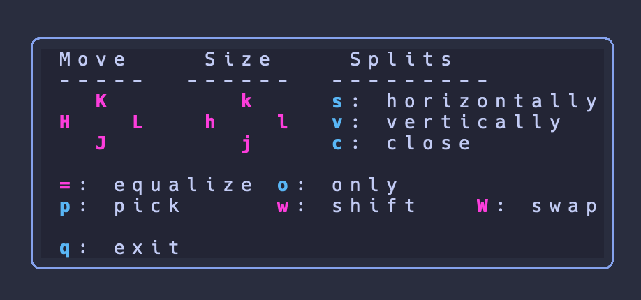
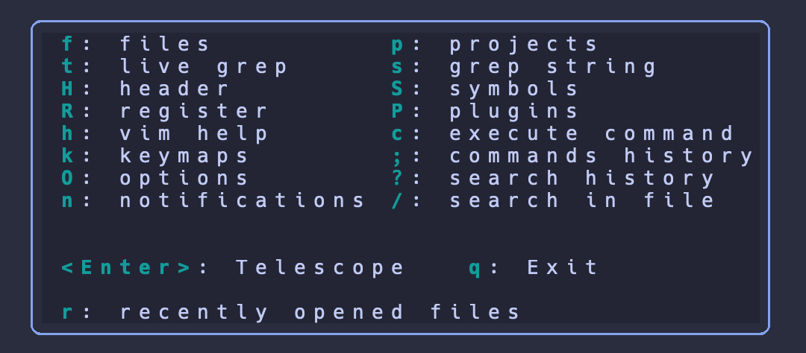
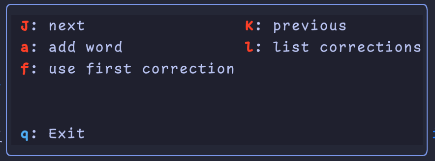

<h1 align="center">My Nvim Configuration</h1>

<div align="center"><p>
    <a href="https://github.com/neovim/neovim">
      
    </a>
    <a href="https://github.com/Allaman/nvim/pulse">
      
    </a>
    <a href="https://github.com/Allaman/nvim/issues">
      
    </a>
    <a href="https://github.com/Allaman/nvim/actions/workflows/ci.yml">
      
    </a>
    <a href="https://github.com/Allaman/nvim/blob/main/LICENSE">
      
    </a>
</p>

</div>


💻 This configuration works on my [Manjaro](https://manjaro.org/) Linux as well as on my macOS and requires Neovim >= 0.8!

Have a look at my [rice](https://github.com/Allaman/rice) how my Linux machine is configured and at my [mac-setup](https://github.com/Allaman/mac-setup) how my MBP is configured. My [dotfiles](https://github.com/Allaman/dotfiles) are also on GitHub.

## More Screenshots

_Terminal_: alacritty

_Font_: Jetbrains Mono

<details>
<summary>Leader Key Clusters via which-key</summary>


See `./lua/core/config/ui/which-key.lua` for details.

</details>

<details>
<summary>Go development</summary>


</details>

<details>
<summary>Debugging via DAP</summary>


</details>

<details>
<summary>Hydra modes for better shortcut handling</summary>





</details>

## Motivation

There are many great Neovim configurations (see [Inspiration](#inspiration)), that give you a pleasant experience right out of the box, available. However, I am a long time (Neo)Vim user with a specific workflow and needs. Additionally, I do not have any Lua background and was not willing to spent too much time into that. Therefore, it was quite hard for me to customize and strip down the existing configs to my needs especially because the code is quite sophisticated.

I decided to move to my own fresh Lua based Neovim from my good old vimrc trying to accomplish the following principles.

## Principles

1. Migrate to Lua based alternative plugins respectively use only Lua based plugins (if possible).
1. Keep the config as maintainable as possible knowing that this would possibly impact the code quality.
1. Modular and meaningful directory structure and file naming.
1. Just make it work and not make it beautiful 😃. Of course, Neovim itself must look beautiful, but my focus is not on beautiful code or on utilizing all Lua features.

## Features

### General ⚙️

- Package management and plugin configuration via [lazy.nvim](https://github.com/folke/lazy.nvim)
- Mnemonic keyboard mappings inspired by [Spacemacs](https://www.spacemacs.org/) via [which-key.nvim](https://github.com/folke/which-key.nvim); no more than three keystrokes for each keybinding
- Submodes powered by [Hydra.nvim](https://github.com/anuvyklack/hydra.nvim)
- Complete transformation via [noice.nvim](https://github.com/folke/noice.nvim)
- Fully featured status line via [mini.nvim](https://github.com/echasnovski/mini.nvim)
- Terminal integration via [nvim-toggleterm.lua](https://github.com/akinsho/nvim-toggleterm.lua)
- Fancy notifications via [nvim-notify](https://github.com/rcarriga/nvim-notify)
- Better writing with [ltex-ls](https://valentjn.github.io/ltex/index.html)
- Dashboard via [alpha.nvim](https://github.com/goolord/alpha-nvim) with recent files and quick links
- Multiple preconfigured themes like [catppuccin](https://github.com/catppuccin/nvim), [tokyonight](https://github.com/folke/tokyonight.nvim), [nightfox](https://github.com/EdenEast/nightfox.nvim), and more
- Fast startup < 150 ms 🚀

### Navigation 🧭

- [Telescope.nvim](https://github.com/nvim-telescope/telescope.nvim) for all your search needs
- Project management with [Project.nvim](https://github.com/ahmedkhalf/project.nvim)
- File tree navigation/manipulation via [neo-tree](https://github.com/nvim-neo-tree/neo-tree.nvim)
- Better Tmux navigation with your home row via [Navigator.nvim](https://github.com/numToStr/Navigator.nvim)
- Convenient jumping through windows with [nvim-window-picker](https://gitlab.com/s1n7ax/nvim-window-picker)

### Coding 🖥️

- Auto completion powered by [nvim-cmp](https://github.com/hrsh7th/nvim-cmp)
- Built-in LSP configured via [nvim-lspconfig](https://github.com/neovim/nvim-lspconfig)
- Debugging for Go and Python via [nvim-dap](https://github.com/mfussenegger/nvim-dap) and friends
- [Treesitter](https://github.com/nvim-treesitter/nvim-treesitter) and [Tresitter-textobjects](https://github.com/nvim-treesitter/nvim-treesitter-textobjects) for your syntax needs
- Auto formatting via [null-ls.nvim](https://github.com/jose-elias-alvarez/null-ls.nvim)
- Excellent Go support via LSP and [go.nvim](https://github.com/ray-x/go.nvim) including sensible keybindings
- Always know where you are in your code via [nvim-navic](https://github.com/SmiteshP/nvim-navic)
- Git integration via [Neogit](https://github.com/TimUntersberger/neogit) and [gitsigns](https://github.com/lewis6991/gitsigns.nvim)
- Outlining symbols with [symbols-outline.nvim](https://github.com/simrat39/symbols-outline.nvim)
- Snippets provided by [Luasnip](https://github.com/L3MON4D3/LuaSnip) and [friendly snippets](https://github.com/rafamadriz/friendly-snippets) with autocompletion
- Schema integration via LSPs for Kubernetes, package.json, GitHub workflows, gitlab-ci.yml, kustomization.yaml, and more

## Try out

If you have [Docker](https://www.docker.com/) on your system you can try out this config via the provided `Dockerfile`

💡 Due to installing required tools like LSPs, CLI apps, etc. the image is approximately 3 GB large

### Build the image

There are some issues with building a multi architecture Docker image via GitHub Action. Until I sorted that out, you can build the Docker image locally on your own

```sh
docker build -t nvim .
```

### Just start nvim

```sh
docker run --name nvim --rm -it nvim
```

### Mount a local directory (to ~/mount) and start nvim

```sh
docker run --name nvim --rm -it -v ${HOME}/tmp:/home/nvim/mount nvim
```

### Start container in bash instead of nvim

```sh
docker run --name nvim --rm -it --entrypoint=/bin/bash nvim
```

## Installation

I created an installation [script](install.sh) that sets up all required tools on a fresh machine to work with my Neovim config.

For now, it works on Debian/Ubuntu and Arch. MacOS will be added soon.

USE AT YOUR OWN RISK!!

## Requirements

There are some tools that are required in order to use some features/plugins:

### Tools

- [ripgrep](https://github.com/BurntSushi/ripgrep)
- [fd](https://github.com/sharkdp/fd)
- [fzf](https://github.com/junegunn/fzf)

For neo-tree delete functionality:

- [trash-cli](https://github.com/andreafrancia/trash-cli)

For Latex functionality:

- [Tectonic](https://tectonic-typesetting.github.io/en-US/)
- [Skim](https://skim-app.sourceforge.io/)

### LSPs, Formatting, Linters, DAP

The following programs should be installed on your system so that the appropriate tools can be installed:

- Go
- Python
- NodeJs > 12
- Cargo

#### Go

Go related dependencies are managed by `go.nvim` and are installed by running `:GoInstallBinaries` (when a Go file is loaded). They are installed in your `$GOPATH`.

#### All other

All other dependencies are managed by [Mason](https://github.com/williamboman/mason.nvim) and [Mason tool installer](https://github.com/WhoIsSethDaniel/mason-tool-installer.nvim). Tools are installed by running `:MasonToolsInstall` (in `vim.fn.std path("data") .. "mason"`). [Mason requirements](https://GitHub.com/William beman/mason.nvim#requirements) must be available on your system.

## Bindings

| Mode    | key                    | binding                                                |
| ------- | ---------------------- | ------------------------------------------------------ |
| n       | space                  | Leader key                                             |
| n       | \<c-h \| j \| k \| l\> | Change window focus (including Tmux panes)             |
| n       | \<leader\>Tab          | Switch to previously opened buffer                     |
| n       | \<Tab\>                | Switch to next buffer (bnext)                          |
| n       | \<S-Tab\>              | Switch to previous buffer (bprevious)                  |
| n       | st                     | Visual selection with Treesitter hint textobject       |
| v       | sa                     | Add surrounding                                        |
| n       | sd                     | Delete surrounding                                     |
| n       | sr                     | Replace surrounding                                    |
| n       | \<c-Tab\>              | Start auto completion (without typing anything)        |
| n/v     | ga                     | Start mini.align (align text)                          |
| n       | gcc                    | Toggle line comment                                    |
| n/v     | gc                     | Toggle line comment (works with movements like `gcip`) |
| n       | ss                     | Search 2 char (mini.jump2d)                            |
| i/s     | \<c-j\>                | Luasnip expand/forward                                 |
| i/s     | \<c-k\>                | Luasnip backward                                       |
| i       | \<c-h\>                | Luasnip select choice                                  |
| n       | \<c-n\>                | Toggleterm (opens/hides a full terminal in Neovim)     |
| i       | \<c-l\>                | Move out of closing brackets                           |
| n       | \<CR\>                 | Start incremental selection                            |
| v       | \<Tab\>                | Increment selection                                    |
| v       | \<S-Tab\>              | Decrement selection                                    |
| n       | \<c-f\>                | Search buffer                                          |
| i/v/n/s | \<c-s\>                | Save file                                              |

Hit `<leader>` to start `which-key` which gives you more mappings grouped by topic.

## Structure

`tree1 .`

```sh
.
├── after            # file specific settings
├── init.lua         # main entry point
├── lazy-lock.json   # Lockfile for Lazy.nvim
├── lua/core         # lua configuration
├── snippets         # snippets directory (luasnip style)
└── spell            # my spell files linked from another repo
```

`tree1 lua/core`

```sh
lua/core
├── autocmd.lua      # autocmds for various things
├── config           # configuration folder for plugins
├── globals.lua      # global functions
├── lazy.lua         # Lazy configuration
├── mappings.lua     # key bindings
├── options.lua      # vim options
├── plugins          # plugins and their configuration
├── settings.lua     # user settings to configure
```

Each plugin to be installed is defined in `./lua/core/plugins/` in a separate file.

## User configuration

The intention of my Neovim configuration was never to be a fully customizable "distribution" like LunarVim, SpaceVim, etc. but from time to time I like to change my color scheme and the idea of making this configurable came to my mind. Based upon this idea I implemented some further lightweight configuration options that might be useful.

All options can be found in `./lua/core/settings.lua`.

## Remove plugins

You can remove unwanted plugins by just removing the appropriate file in `./lua/core/plugins/`. Lazy will take care of removing the plugin.

**Keep in mind that some plugins are configured to work in conjunction with other plugins. For instance, autopairs is configured in `./lua/vim/config/treesitter.lua`. For now there is no logic implemented that cross-checks such dependencies.**

## Add plugins

If you want to follow my method adding a plugin is straight forward:

Create a file in `./lua/core/plugins/` following the expected format of Lazy.

Open another instance of Neovim (I always try to keep one running instance of Neovim open in case I messed up my config) and run `Lazy sync`.

## Inspiration

- [LazyVim](https://github.com/LazyVim/LazyVim)
- [LunarVim](https://github.com/LunarVim/LunarVim)
- [SpaceVim](https://spacevim.org/)
- [Doom-nvim](https://github.com/NTBBloodbath/doom-nvim)
- [spf13-vim](https://github.com/spf13/spf13-vim)
- [NvChad](https://nvchad.github.io/)
- [Janus](https://github.com/carlhuda/janus)
