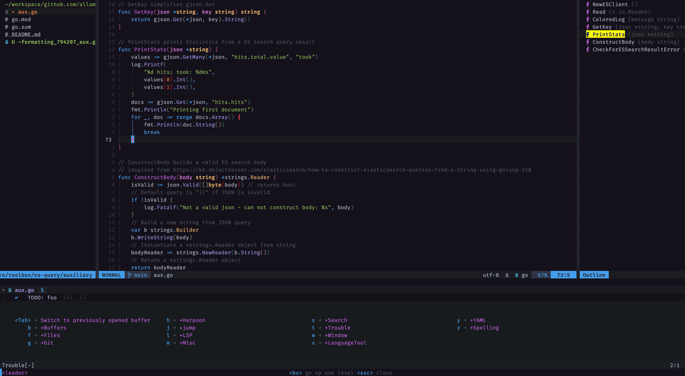

# My NeoVim Configuration



This is my first Lua based NeoVim (>0.5) configuration. My goal was to achieve the same functionality as [my old vimrc](https://github.com/Allaman/dotfiles/blob/master/vimrc) and move onwards to a full Lua based configuration and Lua based plugins especially the promising builtin [LSP](https://neovim.io/doc/user/lsp.html) and [Treesitter](https://github.com/nvim-treesitter/nvim-treesitter).

## Motivation

There is a number of great NeoVim configurations online (see [Inspiration](#inspiration)) that give you a pleasant experience right out of the box. However, I am a long time (Neo)Vim user with a specific workflow and needs. Additionally, I do not have any Lua background and was not willing to spent too much time into that. Therefore, it was quite hard for me to customize and strip down the existing configs to my needs especially because the code is quite sophisticated.

So I decided to move to a fresh Lua based NeoVim on my own trying to accomplish the following:

1. At least feature parity with my mentioned old vimrc
2. Migrate to Lua based alternative plugins
3. Keep the config as simple as possible knowing that this would possibly impact the code quality
4. Just make it work and not make it beautiful 😃

## Features

- Package management via [Packer](https://github.com/wbthomason/packer.nvim)
- Lazy-loading selected plugins for startup in under 60ms 🚀
- [Telescope.nvim](https://github.com/nvim-telescope/telescope.nvim) for all your search needs
- Mnemonic keyboard mappings (no more than three keystrokes) inspired by [Spacemacs](https://www.spacemacs.org/) via [which-key.nvim](https://github.com/folke/which-key.nvim)
- Auto completion powered by [nvim-cmp](https://github.com/hrsh7th/nvim-cmp)
- Project management with [Project.nvim](https://github.com/ahmedkhalf/project.nvim)
- Built-in LSP configured via [nvim-lspconfig](https://github.com/neovim/nvim-lspconfig)
- Asynchronous auto formatting via [Formatter.nvim](https://github.com/mhartington/formatter.nvim)
- Git via [Neogit](https://github.com/TimUntersberger/neogit), [gitsigns](https://github.com/lewis6991/gitsigns.nvim), [git-blame](https://github.com/f-person/git-blame.nvim), and [gitui](https://github.com/extrawurst/gitui)
- File tree navigation/manipulation via [nvim-tree](https://github.com/kyazdani42/nvim-tree.lua)
- Awesome status line via [Lualine](https://github.com/nvim-lualine/lualine.nvim)
- [Treesitter](https://github.com/nvim-treesitter/nvim-treesitter) and [Tresitter-textobjects](https://github.com/nvim-treesitter/nvim-treesitter-textobjects) for your syntax needs
- Buffer management via [Bufferline.nvim](https://github.com/akinsho/bufferline.nvim)
- [LF](https://github.com/gokcehan/lf) integration via [lf.vim](https://github.com/ptzz/lf.vim)
- Terminal integration via [nvim-toggleterm.lua](https://github.com/akinsho/nvim-toggleterm.lua)
- Easy Tmux navigation with your homerow via [Navigator.vim](https://github.com/numToStr/Navigator.nvim)
- Schema integration via LSPs like package.json, github workflows, gitlab-ci.yml, kustomization.yaml, and more
- and much more...

## Structure

Each plugin to be installed is defined in `plugins.lua` and each plugin has its own configuration file (if necessary) in `lua/config` which is loaded by packer.

```
.
├── ftplugin/         # file specific settings
├── init.lua          # main entry point
├── lua
│   ├── autocmd.lua   # vim autocommands
│   ├── config/       # each plugin configuration is in its own file
│   ├── mappings.lua  # Vim keymaps defintions -> config/which.lua for more
│   ├── options.lua   # non plugin related (vim) options
│   └── plugins.lua   # define plugins to be managed via Packer
├── plugins           # packer_compiled
├── snippets          # snippets for vsnip
└── spell             # my spell files linked from another repo
```

## Requirements

There are some tools that are required in order to use some functions.

- Searching:
  - [ripgrep](https://github.com/BurntSushi/ripgrep)
  - [fd](https://github.com/sharkdp/fd)
- Autoformatting:
  - [prettier](https://prettier.io/)
  - [gofmt](https://pkg.go.dev/cmd/gofmt)
  - [terraform fmt](https://www.terraform.io/docs/cli/commands/fmt.html)
  - [luarocks](https://github.com/luarocks/luarocks) and `luarocks install --server=https://luarocks.org/dev luaformatter`
  - [black](https://github.com/psf/black)
- Language servers for the builtin LSP (see [lspconfig](https://github.com/neovim/nvim-lspconfig/blob/master/CONFIG.md) for more info about LSP configuration)
  - `sudo npm i -g bash-language-server dockerfile-language-server-nodejs yaml-language-server typescript typescript-language-server vscode-langservers-extracted`
  - `go get golang.org/x/tools/gopls`
  - [terraform-ls](https://github.com/hashicorp/terraform-ls)
  - [texlab](https://github.com/latex-lsp/texlab) and [tectonic](https://github.com/tectonic-typesetting/tectonic)
  - [lua-language-server](https://github.com/sumneko/lua-language-server)
- For advanced spell checks via [vim-grammarous](https://github.com/rhysd/vim-grammarous) Java 8+ is required

## Inspiration

- [LunarVim](https://github.com/LunarVim/LunarVim)
- [SpaceVim](https://spacevim.org/)
- [Doom-nvim](https://github.com/NTBBloodbath/doom-nvim)
- [spf13-vim](https://github.com/spf13/spf13-vim)
- [NvChad](https://nvchad.github.io/)
- [Janus](https://github.com/carlhuda/janus)
